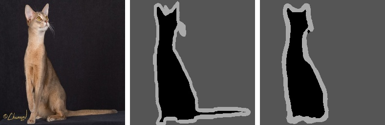

# Multiclass-Segmentation-in-Unet
A simple multiclass segmentation tutorial on the Oxford-IIIT Pet dataset using the U-Net architecture.
 
Video explaination: [https://youtu.be/afqf_sxDyiY](https://youtu.be/afqf_sxDyiY)

## Dataset:
 

Download the dataset: [https://www.robots.ox.ac.uk/~vgg/data/pets](https://www.robots.ox.ac.uk/~vgg/data/pets/)

## Results
The images given below are in the sequence: (1) Input Image, (2) Ground Truth, (3) Predicted Mask    

## Contact:
For more follow me on:

- <a href="https://www.youtube.com/idiotdeveloper"> YouTube </a>
- <a href="https://facebook.com/idiotdeveloper"> Facebook </a>
- <a href="https://twitter.com/nikhilroxtomar"> Twitter </a>
- <a href="https://www.instagram.com/nikhilroxtomar"> Instagram </a>
- <a href="https://www.patreon.com/idiotdeveloper"> Pateron </a>
